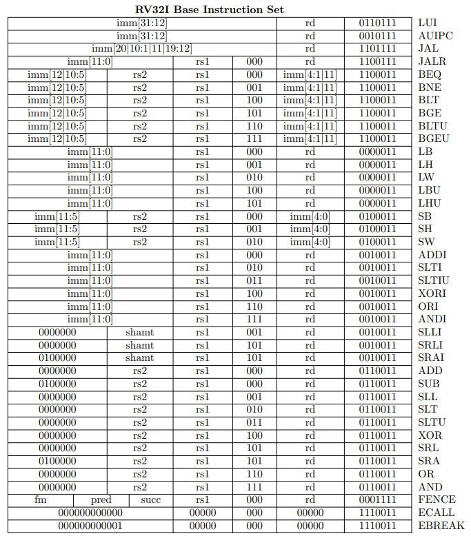

# RISC-V CPU

## RV32I

- [Post Project](https://github.com/SungChul-CHA/RISCV-SoC)

|  <b>RV32I Instruction Set</b>   |
| :-----------------------------: |
|  |

---

**CPU 관점에서 구분한 Instruction TYPE**

|  Inst  | Task                                           |     State     | note                                                        |
| :----: | :--------------------------------------------- | :-----------: | :---------------------------------------------------------- |
|  LUI   | rd = {imm20, 12'b0}                            |      WB       | U-TYPE                                                      |
| AUIPC  | rd = PC + {imm20, 12'b0}                       |   EXEI, WB    | U-TYPE                                                      |
|  JAL   | PC = PC + {imm20, 1'b0} rd = PC + 4         |     JTYPE     | PC + 4 로직이 이미 있으므로, U-TYPE과는 다르게 동작 가능 |
|  JALR  | PC = (rs1 + imm12) & {31'b1, 0} rd = PC + 4 |     JTYPE     | PC + 4 로직이 이미 있으므로, U-TYPE과는 다르게 동작 가능 |
| Branch | alu : rs1 - rs2 PC = PC + {imm12, 1'b0}     |     BTYPE     | alu 2번 써야함.  PC 값 update mux에 추가                 |
|  LOAD  | alu : rs1 + imm12 rd = \*alu_out            | EXEI, MEM, WB | Memory Read Timing 주의                                     |
| STORE  | alu : rs1 + imm12 \*alu_out = rs2           |   EXEI, MEM   | S-TYPE                                                      |
| I-TYPE | rd = rs1 + imm12                               |   EXEI, WB    | I-TYPE                                                      |
| R-TYPE | rd = rs1 + rs2                                 |   EXER, WB    | R-TYPE                                                      |

 

**ALU 관점에서 구분한 instruction type**

| opcode  | inst type |                             instruction                              |                        alu operate                         | alu source |
| :-----: | :-------: | :------------------------------------------------------------------: | :--------------------------------------------------------: | :--------: |
| 0110111 |     -     |                                 LUI                                  |                          NO OPER                           | NO SOURCE  |
| 0010111 |     -     |                                AUIPC                                 |                             +                              | PC, imm20  |
| 1101111 |  J-type   |                                 JAL                                  |                             +                              | PC, imm20  |
| 1100111 |  I-type   |                                 JALR                                 |                             +                              | rs1, imm12 |
| 1100011 |  B-type   |               BEQ BNE BLT BGE BLTU BGEU               |                             -                              |  rs1, rs2  |
| 0000011 |  I-type   |                     LB LH LW LBU LHU                     |                             +                              | rs1, imm12 |
| 0100011 |  S-type   |                            SB SH SW                            |                             +                              | rs1, imm12 |
| 0010011 |  I-type   | ADDI SLTI SLTIU XORI ORI ANDI SLLI SRLI SRAI |  + - - ^  \|   &   <<   >>   >>>   | rs1, imm12 |
| 0110011 |  R-type   |  ADD SUB SLL SLT SLTU XOR SRL SRA OR AND  | + -  <<  - - ^  >>   >>>  \|  & |  rs1, rs2  |

> alu_op : +, -, <<, ^, >>, >>>, |, & &rarr; 8개 = 3bit
