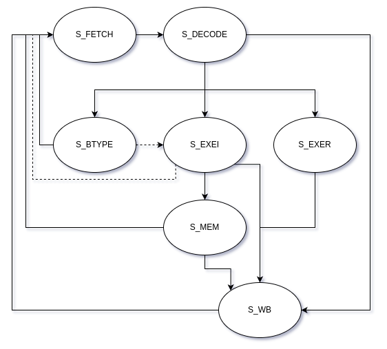

# RISC-V CPU

## RV32I

- [Post Project](https://github.com/SungChul-CHA/RISCV-SoC)

|  <b>RV32I Instruction Set</b>   |
| :-----------------------------: |
|  |

---

**수행해야 할 동작으로 구분한 Instruction TYPE**

|  Inst  | Task                                           |     State     | note                                        |
| :----: | :--------------------------------------------- | :-----------: | :------------------------------------------ |
|  LUI   | rd = {imm20, 12'b0}                            |      WB       | U-TYPE                                      |
| AUIPC  | rd = PC + {imm20, 12'b0}                       |   EXEI, WB    | U-TYPE                                      |
|  JAL   | PC = PC + {imm20, 1'b0} rd = PC + 4         |   EXEI, WB    | J-TYPE                                      |
|  JALR  | PC = (rs1 + imm12) & {31'b1, 0} rd = PC + 4 |   EXEI, WB    | J-TYPE                                      |
| Branch | alu : rs1 - rs2 PC = PC + {imm12, 1'b0}     |  BTYPE, EXEI  | alu 2번 써야함.  PC 값 update mux에 추가 |
|  LOAD  | alu : rs1 + imm12 rd = \*alu_out            | EXEI, MEM, WB | Memory Read Timing 주의                     |
| STORE  | alu : rs1 + imm12 \*alu_out = rs2           |   EXEI, MEM   | S-TYPE                                      |
| I-TYPE | rd = rs1 + imm12                               |   EXEI, WB    | I-TYPE                                      |
| R-TYPE | rd = rs1 + rs2                                 |   EXER, WB    | R-TYPE                                      |

> State : FETCH, DECODE, EXEI, EXER, BTYPE, MEM, WB &rarr; 7개 
> 9개 : MEM &rarr; MEM_R, MEM_W + J_TYPE 
> 11개 : WB &rarr; MEM_WB, ALU_WB + EXE_MEM_ADDR

 

**instruction 구조로 구분한 instruction type**

|  opcode   | inst type |                             instruction                              |                        alu operate                         |         alu source          |
| :-------: | :-------: | :------------------------------------------------------------------: | :--------------------------------------------------------: | :-------------------------: |
| 01_101_11 |  U-type   |                                 LUI                                  |                          NO OPER                           |          NO SOURCE          |
| 00_101_11 |  U-type   |                                AUIPC                                 |                             +                              |          PC, imm20          |
| 11_011_11 |  J-type   |                                 JAL                                  |                             +                              |          PC, imm20          |
| 11_001_11 |  I-type   |                                 JALR                                 |                             +                              |         rs1, imm12          |
| 11_000_11 |  B-type   |               BEQ BNE BLT BGE BLTU BGEU               |                             -                              | 1. rs1, rs2 2. PC, imm12 |
| 00_000_11 |  I-type   |                     LB LH LW LBU LHU                     |                             +                              |         rs1, imm12          |
| 01_000_11 |  S-type   |                            SB SH SW                            |                             +                              |         rs1, imm12          |
| 00_100_11 |  I-type   | ADDI SLTI SLTIU XORI ORI ANDI SLLI SRLI SRAI |  + - - ^  \|   &   <<   >>   >>>   |         rs1, imm12          |
| 01_100_11 |  R-type   |  ADD SUB SLL SLT SLTU XOR SRL SRA OR AND  | + -  <<  - - ^  >>   >>>  \|  & |          rs1, rs2           |

> alu_op : +, -, <<, ^, >>, >>>, |, & &rarr; 8개 = 3bit

---

> MUX, DEMUX 빠진 그림

 

|        <b>FSM 구조</b>        |
| :---------------------------: |
|  |

> FETCH : PC Update, Instruction Read 
> DECODE : Datapath Configure(imm, alu src, alu out, rd, rs1, rs2, pc_next, ...) 
> BTYPE : branch condition check, Calculate Next PC / Go to Fetch 
> EXEI : Calculate, Write Back / Use the result as Memory Addr 
> EXER : Calculate 
> MEM : R/W from/to Mem (DECODE State choose) 
> WB : Store to Register Files

 

> 자세한 타이밍은 맞지 않을 수 있음.

---

|           <b>FSM Waveform</b>           |
| :-------------------------------------: |
|  |

> 0 : Fetch 
> 1 : Decode 
> 2 : EXE I-type 
> 3 : EXE R-type 
> 4 : B-type 
> 5 : Memory Access 
> 6 : Write Back 
> 7 : Error 

|    <b>Program Counter Waveform</b>     |
| :------------------------------------: |
|  |

> pc_next : pc + 4  
> pc : current pc

|       <b>Controller Waveform</b>       |
| :------------------------------------: |
|  |

> State
>
> 0 : Fetch 
>> 1 : Decode 
>> 2 : EXE I-type 
>> 3 : EXE R-type 
>> 4 : B-type 
>> 5 : Memory Access 
>> 6 : Write Back 
>> 7 : Error 
>  
> alu_op
>> 0000 : ADD 
>> 0001 : SUB 
>> 0010 : SLT 
>> 0011 : SLTU 
>> 0100 : XOR 
>> 0101 : OR 
>> 0110 : AND 
>> 0111 : SLL 
>> 1000 : SRL 
>> 1001 : SRA 
>  
> rd_source
>> 11 : OP_LUI 
>> 10 : OP_JAL, OP_JALR 
>> 01 : OP_LOAD 
>> 00 : default
